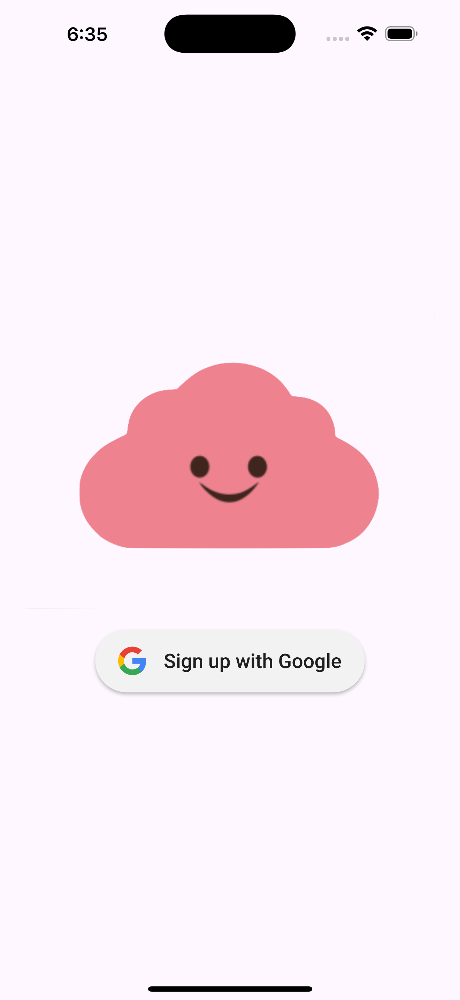
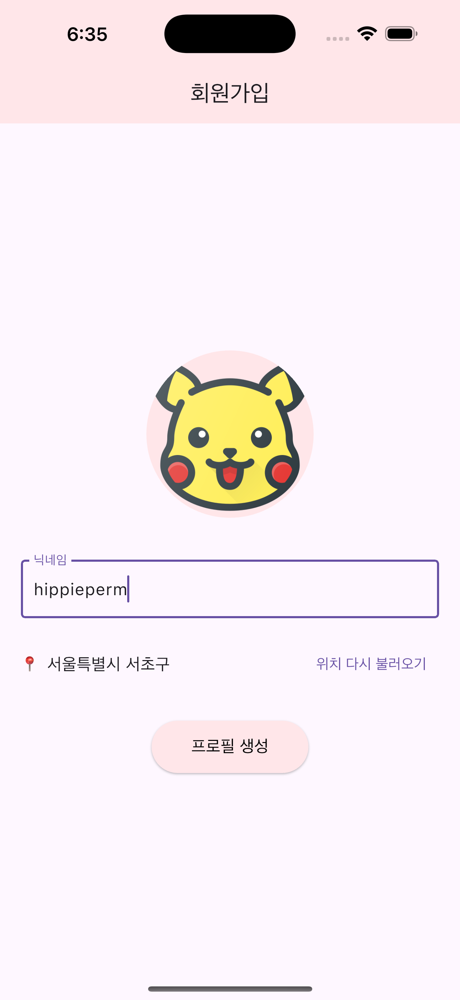
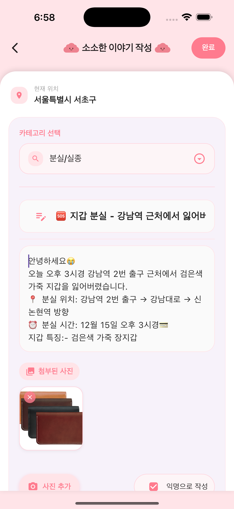

# 🌟 소동 앱 (Sodong App)

> 📍 위치 기반 소셜 네트워킹 플랫폼

## 🚀 프로젝트 소개

소동 앱은 Flutter로 개발된 위치 기반 소셜 네트워킹 애플리케이션입니다. 사용자들이 자신의 위치를 기반으로 게시물을 작성하고, 주변 사람들과 소통할 수 있는 플랫폼을 제공합니다.

## ✨ 주요 기능

### 🔐 인증 시스템

- **구글 소셜 로그인** - 간편한 로그인 경험
- **프로필 관리** - 개인정보 수정 및 관리
- **약관 동의** - 개인정보처리방침, 위치정보 이용약관 등

### 📝 게시물 관리

- **게시물 작성** - 위치 정보와 함께 게시물 생성
- **게시물 목록** - 주변 게시물 실시간 조회
- **게시물 상세** - 상세 내용 및 상호작용

### 📍 위치 서비스

- **실시간 위치 추적** - GPS 기반 정확한 위치 정보
- **위치 기반 필터링** - 주변 게시물만 선별적 표시

### 📷 미디어 기능

- **이미지 업로드** - 갤러리 및 카메라 연동
- **Firebase Storage** - 안전한 미디어 파일 저장

## 🛠 기술 스택

### Frontend

-  **Flutter 3.0+**
-  **Dart**
-  **Flutter Riverpod** - 상태 관리

### Backend & Services

-  **Firebase**
  - 🔥 **Firebase Auth** - 사용자 인증
  - 🗄️ **Cloud Firestore** - NoSQL 데이터베이스
  - 📁 **Firebase Storage** - 파일 저장소

### 주요 패키지

```yaml
dependencies:
  flutter_riverpod: ^2.5.1 # 🔄 상태 관리
  firebase_core: ^3.13.0 # 🔥 Firebase 코어
  firebase_auth: ^5.5.3 # 🔐 인증
  cloud_firestore: ^5.6.7 # 🗄️ 데이터베이스
  firebase_storage: ^12.4.5 # 📁 스토리지
  geolocator: ^14.0.0 # 📍 위치 서비스
  google_sign_in: ^6.3.0 # 🔑 구글 로그인
  image_picker: ^1.1.2 # 📷 이미지 선택
  dio: ^5.8.0+1 # 🌐 HTTP 클라이언트
```

## 📱 앱 구조

```
lib/
├── 🎯 main.dart                 # 앱 진입점
├── 🔧 core/                     # 핵심 기능
│   └── result/                  # 결과 처리
├── 🎨 features/                 # 기능별 모듈
│   ├── 🔐 auth/                 # 인증 관련
│   ├── 📝 post/                 # 게시물 관련
│   ├── 📝 post_list/            # 게시물 목록
│   ├── 📄 post_detail/          # 게시물 상세
│   ├── ✏️ create_post/          # 게시물 작성
│   ├── 👤 profile/              # 프로필 관리
│   ├── 📍 location/             # 위치 서비스
│   └── 📍 locations/            # 위치 관리
└── 🔥 firebase_options.dart     # Firebase 설정
```

## 🚀 시작하기

### 📋 사전 요구사항

-  Flutter SDK 3.0.0 이상
-  Dart SDK 3.0.0 이상
-  Android Studio 또는  VS Code
-  Firebase 프로젝트 설정

### 🔧 설치 및 실행

1. **저장소 클론**

```bash
git clone https://github.com/your-username/sodong-app.git
cd sodong-app
```

2. **의존성 설치**

```bash
flutter pub get
```

3. **환경 변수 설정**

```bash
# .env 파일 생성 및 설정
cp .env.example .env
# Firebase 설정 정보 입력
```

4. **Firebase 설정**

```bash
# Firebase CLI 설치 및 로그인
npm install -g firebase-tools
firebase login

# Firebase 프로젝트 설정
flutterfire configure
```

5. **앱 실행**

```bash
flutter run
```

## 📱 앱 스크린샷

<div align="center">

### 🔐 인증 플로우

<table>
  <tr>
    <td align="center">
      
      <br/>
      <b>🚀 스플래시 화면</b>
      <br/>
      <sub>앱 로딩 및 초기화</sub>
    </td>
    <td align="center">
      
      <br/>
      <b>🔑 로그인 화면</b>
      <br/>
      <sub>구글 소셜 로그인</sub>
    </td>
    <td align="center">
      
      <br/>
      <b>👤 프로필 설정</b>
      <br/>
      <sub>초기 프로필 정보 입력</sub>
    </td>
  </tr>
</table>

### 📝 메인 기능

<table>
  <tr>
    <td align="center">
      
      <br/>
      <b>🏠 홈 화면</b>
      <br/>
      <sub>주변 게시물 목록 표시</sub>
    </td>
    <td align="center">
      
      <br/>
      <b>✏️ 게시물 작성</b>
      <br/>
      <sub>위치 정보와 함께 새 게시물 작성</sub>
    </td>
    <td align="center">
      
      <br/>
      <b>📄 게시물 상세</b>
      <br/>
      <sub>게시물 내용 및 상호작용</sub>
    </td>
  </tr>
</table>

</div>

> 💡 **스크린샷 추가 방법**: `screenshots/` 폴더에 위의 파일명으로 스크린샷을 추가해주세요!

## 📱 주요 기능 상세

### 🔐 인증 플로우

- **스플래시 화면** - 앱 로딩 및 초기화
- **약관 동의** - 서비스 이용약관 동의
- **로그인** - 구글 소셜 로그인
- **프로필 설정** - 초기 프로필 정보 입력

### 📝 메인 기능

- **홈 화면** - 주변 게시물 목록 표시
- **게시물 작성** - 위치 정보와 함께 새 게시물 작성
- **게시물 상세** - 게시물 내용 및 상호작용

## 🔒 권한 설정

### Android (`android/app/src/main/AndroidManifest.xml`)

```xml
<uses-permission android:name="android.permission.ACCESS_FINE_LOCATION" />
<uses-permission android:name="android.permission.ACCESS_COARSE_LOCATION" />
<uses-permission android:name="android.permission.CAMERA" />
<uses-permission android:name="android.permission.READ_EXTERNAL_STORAGE" />
```

### iOS (`ios/Runner/Info.plist`)

```xml
<key>NSLocationWhenInUseUsageDescription</key>
<string>이 앱은 주변 게시물을 표시하기 위해 위치 정보가 필요합니다.</string>
<key>NSCameraUsageDescription</key>
<string>게시물에 사진을 첨부하기 위해 카메라 접근이 필요합니다.</string>
```

## 🏗 아키텍처

### 📁 Clean Architecture + Feature-First

```
features/
└── auth/
    ├── data/           # 데이터 레이어
    ├── domain/         # 도메인 레이어
    └── presentation/   # 프레젠테이션 레이어
        ├── pages/      # 화면
        ├── widgets/    # 위젯
        └── providers/  # 상태 관리
```

### 🔄 상태 관리 (Riverpod)

- **Provider** - 의존성 주입
- **StateNotifier** - 복잡한 상태 관리
- **FutureProvider** - 비동기 데이터 처리

## 🤝 기여하기

1. 이 저장소를 포크합니다
2. 새로운 기능 브랜치를 생성합니다 (`git checkout -b feature/amazing-feature`)
3. 변경사항을 커밋합니다 (`git commit -m 'Add some amazing feature'`)
4. 브랜치에 푸시합니다 (`git push origin feature/amazing-feature`)
5. Pull Request를 생성합니다

## 📄 라이선스

이 프로젝트는 MIT 라이선스 하에 배포됩니다. 자세한 내용은 `LICENSE` 파일을 참조하세요.

## 📞 문의

- 📧 **이메일**: your-email@example.com
- 🐛 **이슈 리포트**: [GitHub Issues](https://github.com/your-username/sodong-app/issues)
- 💬 **토론**: [GitHub Discussions](https://github.com/your-username/sodong-app/discussions)

---

<div align="center">

**🌟 소동 앱과 함께 새로운 소셜 경험을 시작하세요! 🌟**

Made with ❤️ by [Your Team Name]

</div>
